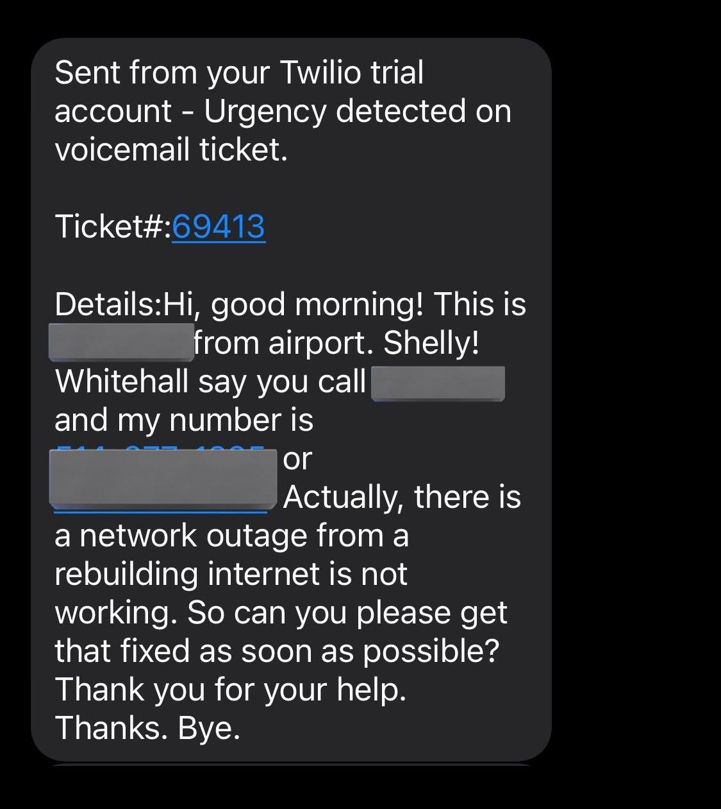

# Voicemail Urgency Detection

This system detects urgency levels in voicemail transcriptions using Google Vertex AI. It provides a backend service that classifies voicemails as urgent or non-urgent, helping streamline response prioritization in IT support.

---

## Overview

- Analyze voicemail transcriptions using machine learning to detect urgency.
- Fine-tune a machine learning model with Google Vertex AI for more acurate detection.
- When the urgent voicemail is detected, the system send text via Twilio to notify and save the data to the database.

---

## Why was this built

This project was created to enable fast and efficient triaging of customer voicemails, especially in IT support environments during after-hours, improving overall response times and service quality.

---

## Tech Stack

- Backend & APIs: Python, Flask, ConnectWise API, Twilio API
- Database: PostgreSQL
- AI / ML: Google Cloud Vertex AI, Google Cloud NLP (initially)
- Testing: Pytest (unit & integration testing)
- DevOps & Deployment: Docker, GitHub Actions, Google Cloud Run

---

## Future Improvements

- Use more advanced NLP (e.g., transformers like BERT).
- Improve dataset with more sample data.

---

## Screenshot

---

